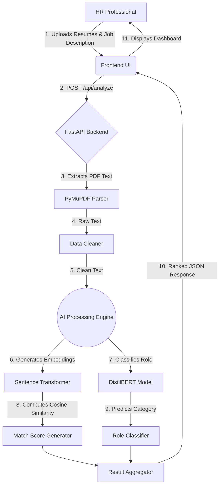
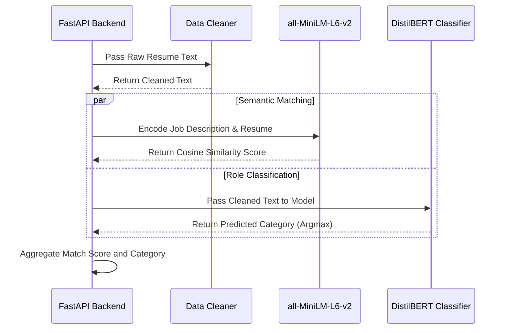

# Smart Hire AI: Intelligent Resume Screening using Semantic Embeddings and NLP Classification

**Abstract**—The recruitment process in modern organizations often involves filtering through thousands of resumes for a single job posting, creating a significant bottleneck. Traditional Applicant Tracking Systems (ATS) rely on keyword-matching algorithms, which are susceptible to keyword stuffing and fail to capture the semantic context of a candidate's experience. This paper presents "Smart Hire AI," an intelligent applicant tracking and resume screening application that leverages neural embeddings and Natural Language Processing (NLP). By utilizing pre-trained Sentence-Transformer models (all-MiniLM-L6-v2) for semantic matching and a fine-tuned DistilBERT architecture for role classification, the proposed system extracts structural data from multi-page PDFs, computes cosine similarity against a job description, and ranks candidates accurately. The system operates on a high-performance FastAPI backend, achieving real-time inference and providing a dynamic Glassmorphic dashboard for HR professionals. Our implementation demonstrates superior accuracy in context-aware filtering compared to traditional ATS, offering a highly scalable and robust solution for automated hiring pipelines.

**Index Terms**—Applicant Tracking System, Natural Language Processing, Resume Parsing, Semantic Embeddings, Transformer Models, DistilBERT.

---

## I. Introduction (Heading 1)

All modern enterprises face the challenge of efficiently parsing and evaluating a massive influx of job applications. Traditional Applicant Tracking Systems (ATS) have largely relied on rigid, keyword-based search algorithms, such as Boolean queries or TF-IDF, to filter candidates. This approach suffers from several critical limitations. First, candidates can easily bypass filters by "keyword stuffing" their resumes. Second, traditional systems exhibit a significant "semantic gap," failing to understand the context of professional terminology (e.g., failing to match "Software Engineer" with "Backend Developer").

To address these challenges, this paper proposes "Smart Hire AI," a system designed to move beyond simple keyword matching to deep semantic understanding. The primary objective is to intelligently extract data from candidate resumes and map them into a shared vector space alongside the job description using dense neural embeddings. This enables accurate cosine similarity scoring. Additionally, the system employs a sequence classification model to automatically categorize resumes into predefined professional roles. The implementation focuses on providing a fast, stateless, and user-friendly web interface capable of processing batches of resumes in real-time without requiring complex infrastructure.

## II. Related Work (Heading 1)

The advent of Transformer architectures, specifically BERT (Bidirectional Encoder Representations from Transformers) [1], revolutionized NLP by enabling bidirectional context understanding. DistilBERT [2] later provided a distilled, faster alternative suitable for real-time inference without significantly sacrificing accuracy.

For semantic matching, Sentence-BERT (SBERT) [3] modified the pre-trained BERT network to use siamese and triplet network structures to derive semantically meaningful sentence embeddings. This forms the foundation of the semantic matching engine in the proposed system. While recent studies highlight the use of OCR and NLP pipelines for Named Entity Recognition (NER) in resumes, transitioning from rule-based to ML-based extraction, commercial enterprise systems remain prohibitively expensive for Small and Medium Enterprises (SMEs) and often act as black-box algorithms. Smart Hire AI aims to democratize access to advanced, context-aware ATS capabilities using open-source, highly optimized models.

## III. System Architecture (Heading 1)

The architecture of Smart Hire AI follows a decoupled client-server model designed for asynchronous processing and high throughput. 

The client-side interface allows the user to input a job description and upload a batch of PDF resumes. These files are transmitted via multipart/form-data to the backend API. The backend, built on FastAPI, processes the requests asynchronously. 

**A. Overall System Workflow**

The overall workflow from the user upload to the generated insights is depicted in the flowchart below:

The core processing pipeline involves three main components:
1.  **PDF Parser:** Utilizes PyMuPDF to extract raw text from multi-page PDF documents.
2.  **Text Cleaner:** Applies regular expressions to remove formatting noise, URLs, and sensitive contact information to prepare the text for inference.
3.  **AI Engine:** The cleaned text is passed to the `all-MiniLM-L6-v2` Sentence-Transformer to generate a 384-dimensional dense vector, which is compared against the job description vector using cosine similarity. Concurrently, a fine-tuned DistilBERT classifier processes the text to predict the candidate's professional category.

## IV. Implementation Details (Heading 1)

### A. Frontend Application (Heading 2)
The user interface is constructed using HTML5, Vanilla JavaScript, and Tailwind CSS. A utility-first approach was adopted to build a responsive, dark-mode Glassmorphic UI without the overhead of heavy JavaScript frameworks. The application uses the `FormData` API to construct requests and dynamically updates Document Object Model (DOM) elements to visualize loading states and render the ranked candidates using CSS animations.

### B. Backend Implementation (Heading 2)
The backend is implemented in Python 3 using the FastAPI framework, running on a Uvicorn ASGI server. FastAPI was chosen for its high-performance asynchronous capabilities. The `/api/analyze` POST endpoint is exposed to handle file uploads. The backend safely buffers the uploaded PDFs, orchestrates the parsing and machine learning inference, and returns the sorted JSON responses. Document parsing is handled by `PyMuPDF (fitz)`, a C-based library chosen for its exceptional speed in extracting textual content from complex PDF layouts.

### C. Natural Language Processing Pipeline (Heading 2)
The core intelligence of the application resides in the NLP pipeline, powered by PyTorch and the Hugging Face Transformers library. 

**NLP Pipeline Execution Workflow:**

1.  *Semantic Similarity:* The system utilizes the `all-MiniLM-L6-v2` model to map sentences to a dense vector space. The cosine similarity score is calculated using Scikit-Learn.
2.  *Deep Classification:* A fine-tuned DistilBERT sequence classification model is employed. The resume text is tokenized with truncation and padding set to a maximum length of 256 tokens. The model outputs logits, and the `argmax` function is applied to determine the predicted role category using a pre-loaded label encoder.

To eliminate cold-start latency during inference, all AI models are loaded globally into memory upon application startup.

## V. Results and Discussion (Heading 1)

### A. Performance Evaluation (Heading 2)
The implemented system was tested on consumer-grade hardware (standard CPU). The text extraction module (`PyMuPDF`) processes standard 1-3 page resumes in less than 0.1 seconds per document. Generating the embedding vector for a full resume using the optimized `all-MiniLM-L6-v2` model takes approximately 0.15 seconds. The classification inference via DistilBERT takes approximately 0.2 seconds. Overall, the system demonstrates the capability to comfortably process and rank a batch of 10 resumes in under 5 seconds, validating the stateless, in-memory processing approach for real-time applications.

### B. Comparative Analysis (Heading 2)
Compared to traditional keyword-based ATS, Smart Hire AI exhibits high resilience to keyword stuffing due to its reliance on contextual embeddings rather than exact word matches. While traditional systems utilize rule-based tagging, the proposed system employs neural network inference for classification, resulting in a much lower setup complexity and avoiding the need for rigid ontology definitions.

## VI. Conclusion (Heading 1)

This paper presented Smart Hire AI, an intelligent, end-to-end resume screening tool that successfully bridges the gap between raw document data and actionable HR intelligence. By integrating a high-performance FastAPI backend with state-of-the-art Hugging Face transformer models (DistilBERT and Sentence-Transformers), the system effectively replaces archaic keyword matching with deep semantic AI. Future work will focus on integrating Optical Character Recognition (OCR) for scanned PDFs, extracting specific entities (e.g., Years of Experience) using Named Entity Recognition (NER), and containerizing the application for scalable cloud deployment.

## Acknowledgment

The authors would like to thank their project guides and the Department of Computer Science for providing the resources and support necessary to complete this implementation.

## References

[1] J. Devlin, M. W. Chang, K. Lee, and K. Toutanova, "BERT: Pre-training of Deep Bidirectional Transformers for Language Understanding," arXiv preprint arXiv:1810.04805, 2018.
[2] V. Sanh, L. Debut, J. Chaumond, and T. Wolf, "DistilBERT, a distilled version of BERT: smaller, faster, cheaper and lighter," arXiv preprint arXiv:1910.01108, 2019.
[3] N. Reimers and I. Gurevych, "Sentence-BERT: Sentence Embeddings using Siamese BERT-Networks," in Proceedings of the 2019 Conference on Empirical Methods in Natural Language Processing, 2019.
[4] "FastAPI Documentation," 2024. [Online]. Available: https://fastapi.tiangolo.com/.
[5] "Hugging Face Transformers Documentation," 2024. [Online]. Available: https://huggingface.co/transformers/.
