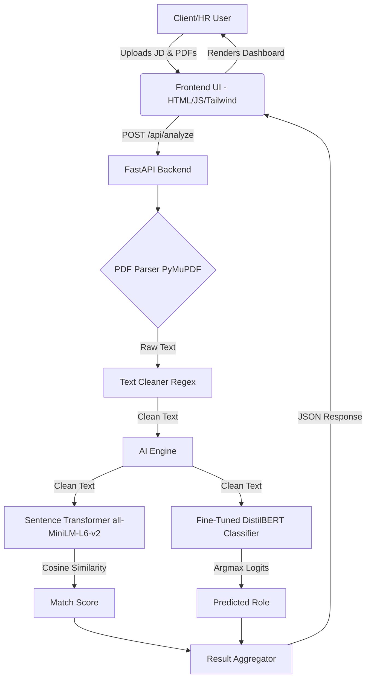
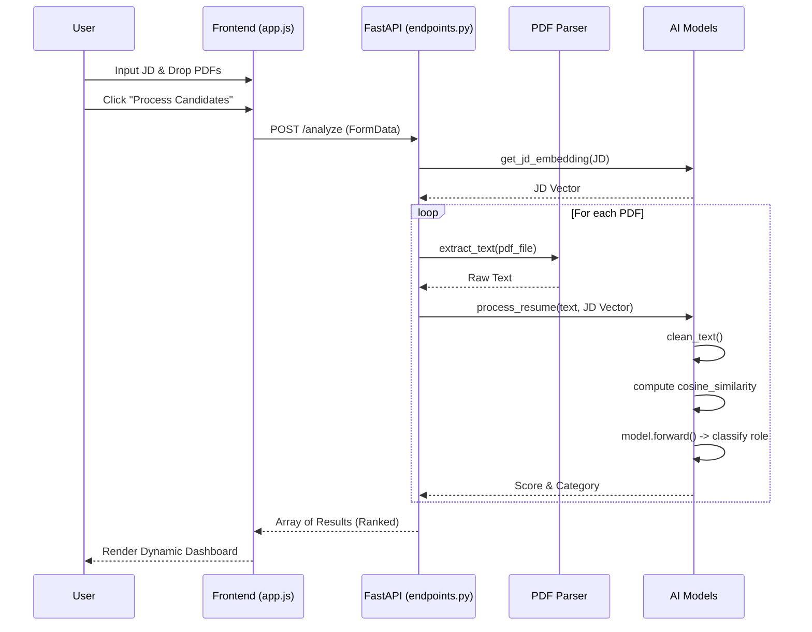
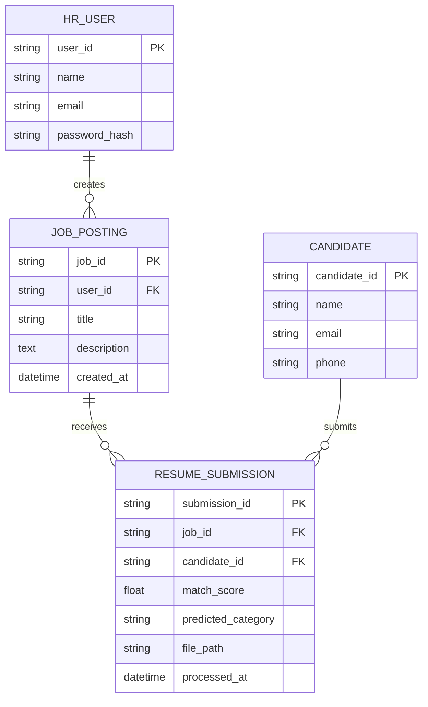

# Smart Hire AI - Final Year Project Thesis

## 6. Index / Table of Contents
* [Chapter 1: Introduction](#chapter-1-introduction)
* [Chapter 2: Literature Survey](#chapter-2-literature-survey)
* [Chapter 3: System Requirement](#chapter-3-system-requirement)
* [Chapter 4: System Design](#chapter-4-system-design)
* [Chapter 5: Implementation](#chapter-5-implementation)
* [Chapter 6: Results](#chapter-6-results)
* [Chapter 7: Future Scope & Conclusion](#chapter-7-future-scope--conclusion)
* [Chapter 8: References](#chapter-8-references)
* [Chapter 9: Paper Publication Certificates](#chapter-9-paper-publication-certificates)

---

## Chapter 1: Introduction

### Project Overview
The hiring process in modern enterprises involves sifting through hundreds or thousands of resumes for a single job posting. **Smart Hire AI** is an advanced applicant tracking and resume screening application designed to alleviate this bottleneck. It leverages neural embeddings and Natural Language Processing (NLP) to instantly analyze, classify, and rank applicant resumes against a specific job description. By moving beyond simple keyword matching to deep semantic understanding, Smart Hire AI ensures that the most qualified candidates are surfaced accurately and efficiently.

### Problem Statement
Traditional ATS (Applicant Tracking Systems) largely rely on rigid keyword-matching algorithms (e.g., Boolean searches or TF-IDF). This approach suffers from significant flaws:
1. **Keyword Stuffing:** Unqualified candidates can easily bypass filters by stuffing their resumes with keywords.
2. **Semantic Gap:** Traditional systems fail to understand context (e.g., "Software Engineer" vs. "Backend Developer").
3. **Manual Overhead:** HR professionals still spend excessive time reading poorly parsed documents.
There is a critical need for an intelligent system that understands the *meaning* behind candidate experiences and job requirements.

### Objectives
1. **Automated Parsing:** To intelligently extract structural data from multi-page PDF resumes while discarding formatting noise.
2. **Semantic Matching:** To utilize dense neural embeddings (Sentence-Transformers) to map job descriptions and candidate profiles into a shared vector space for accurate cosine similarity scoring.
3. **Automated Classification:** To classify resumes into predefined professional categories using a fine-tuned sequence classification model.
4. **User Experience:** To provide a premium, dynamic, and responsive Glassmorphic dashboard for HR professionals.

### Scope of the Project
The current scope includes:
- Support for batch uploading of PDF resumes.
- Real-time text extraction and data cleaning.
- Semantic matching using `all-MiniLM-L6-v2`.
- Role prediction using a fine-tuned DistilBERT classification model.
- A comprehensive frontend interface that visualizes match scores, ranks candidates, and allows for CSV exportation of results.
- The project is currently stateless (in-memory processing) to prioritize fast, real-time inference, with future scope for database persistence.

---

## Chapter 2: Literature Survey

### Existing Systems
Most enterprise ATS solutions (such as Taleo, Workday, or Greenhouse) have traditionally relied on parsing algorithms combined with Elasticsearch or similar keyword-based retrieval systems. While effective at filtering out candidates lacking specific certifications, they struggle with synonyms, contextual experience, and modern varied job titles.

### Research Papers Review
1. **BERT and Transformer Architectures:** The introduction of BERT (Devlin et al., 2018) revolutionized NLP by enabling bidirectional context understanding. DistilBERT (Sanh et al., 2019) provided a lighter, faster alternative suitable for real-time inference without sacrificing much accuracy.
2. **Sentence Embeddings:** Reimers and Gurevych (2019) introduced Sentence-BERT (SBERT), modifying the pre-trained BERT network to use siamese and triplet network structures to derive semantically meaningful sentence embeddings. This forms the foundation of the semantic matching engine in Smart Hire AI.
3. **Resume Parsing:** Recent studies highlight the use of OCR and NLP pipelines (like SpaCy) for named entity recognition (NER) in resumes, transitioning from rule-based to ML-based extraction.

### Limitations of Current Systems
- **Inability to capture semantics:** Current systems penalize candidates who use different terminology than the job description (e.g., "Machine Learning" vs. "AI").
- **High cost:** Advanced AI-driven ATS solutions are prohibitively expensive for small to medium enterprises (SMEs).
- **Black-box algorithms:** Many commercial platforms do not provide transparency on how a candidate was scored.

---

## Chapter 3: System Requirement

### Requirement Analysis
**Functional Requirements:**
- The system must allow users to input a Job Description in plain text.
- The system must accept multiple PDF files as candidate resumes.
- The system must extract text from the uploaded PDFs accurately.
- The system must calculate a match percentage (0-100%) between the resume and the job description.
- The system must classify the resume into a specific role category.
- The system must present a sorted list of candidates based on their match score.
- The system must allow users to export the results to a CSV file.

**Non-Functional Requirements:**
- **Performance:** Text extraction, embedding generation, and classification should process in under a few seconds per resume.
- **Usability:** The interface must be intuitive, requiring no technical training to operate.
- **Scalability:** The backend API (FastAPI) must be capable of handling concurrent requests asynchronously.

### Feasibility Study
- **Technical Feasibility:** Python's ecosystem (FastAPI, PyTorch, Hugging Face Transformers, PyMuPDF) provides all necessary libraries to build this system. It is highly technically feasible.
- **Economic Feasibility:** By utilizing open-source models (MiniLM and DistilBERT) rather than paid APIs (like OpenAI's GPT-4), the operational costs are minimized to just hosting infrastructure. It is highly economically feasible.
- **Operational Feasibility:** The system requires no complex installation for the end-user. The web-based interface is universally accessible, ensuring smooth operational integration into existing HR workflows.

---

## Chapter 4: System Design

### Architecture Diagram
The architecture follows a decoupled client-server model.



### UML Diagrams

**Use Case Diagram**
```mermaid
usecaseDiagram
    actor HR_Manager as "HR Manager"
    HR_Manager --> (Input Job Description)
    HR_Manager --> (Upload Resumes)
    HR_Manager --> (Initiate Processing)
    HR_Manager --> (View Ranked Results)
    HR_Manager --> (Filter by Category)
    HR_Manager --> (Download CSV Report)
    
    (Initiate Processing) .> (Extract Text) : include
    (Initiate Processing) .> (Calculate Similarity) : include
    (Initiate Processing) .> (Classify Role) : include
```

**Sequence Diagram**


### Database Design (ER Diagram)
*Note: The current implementation operates in-memory to maximize speed for stateless API calls. However, for a fully persistent enterprise deployment, the following logical schema is proposed.*



---

## Chapter 5: Implementation

### Technologies Used
**Frontend:**
- **HTML5 & Vanilla JavaScript:** Core structure and dynamic DOM manipulation without the overhead of heavy frameworks.
- **Tailwind CSS (via CDN):** Utility-first CSS framework used to build the responsive, dark-mode Glassmorphic UI.
- **FontAwesome & Google Fonts:** For iconography and modern typography (Outfit and Inter).

**Backend:**
- **Python 3.x:** Core programming language.
- **FastAPI & Uvicorn:** High-performance async web framework for building the RESTful API.
- **PyMuPDF (fitz):** Extremely fast C-based PDF parsing library.

**Machine Learning & NLP:**
- **Hugging Face Transformers:** For loading the fine-tuned sequence classification model.
- **Sentence-Transformers:** Using `all-MiniLM-L6-v2` to map sentences to a 384-dimensional dense vector space.
- **PyTorch:** Underlying deep learning tensor library.
- **Scikit-Learn:** For calculating Cosine Similarity between embeddings.

### Modules Description
1. **Frontend Application (`app.js` & `index.html`):** 
   Handles the drag-and-drop interface. Uses `FormData` to construct multipart requests. Dynamically updates DOM elements to show loading states with CSS animations.
2. **API Router (`endpoints.py`):** 
   Exposes the `/api/analyze` POST endpoint. Safely saves uploaded PDFs to temporary directories, orchestrates the parsing and ML inference, and returns sorted JSON responses.
3. **Document Parser (`pdf_parser.py`):** 
   A wrapper around PyMuPDF that iterates through PDF pages, extracts textual content, and handles file corruption exceptions gracefully.
4. **AI Engine (`ai_model.py`):** 
   The core intelligence module. Performs aggressive regex-based text cleaning (removing URLs, emails, phone numbers) to prevent data leakage. Loads models globally into memory on startup to eliminate cold-start latency during inference.

### Code Snippets
*AI Processing Logic (`ai_model.py`)*
```python
def process_resume(resume_text: str, jd_emb):
    cleaned = clean_text(resume_text)
    
    # 1. Semantic Similarity
    res_emb = embed_model.encode([cleaned])
    score = cosine_similarity(jd_emb, res_emb)[0][0]
    score = float(max(0.0, score))
    
    # 2. Deep Classification
    category = "Uncategorized"
    if model and tokenizer and label_encoder:
        inputs = tokenizer(cleaned, truncation=True, padding="max_length", max_length=256, return_tensors="pt")
        with torch.no_grad():
            outputs = model(**inputs)
            logits = outputs.logits
            pred_idx = torch.argmax(logits, dim=1).item()
            category = label_encoder.inverse_transform([pred_idx])[0]
            
    return category, score
```

---

## Chapter 6: Results

### Output Screenshots
*(Note: In the final printed thesis, actual screenshots of the application running should be inserted here.)*
- **Figure 6.1:** SmartHire AI Landing Page and Input Dashboard.
- **Figure 6.2:** Drag and Drop File Upload Interface.
- **Figure 6.3:** Ranked Candidate Results showing Match Scores, Progress Bars, and Predicted Roles.
- **Figure 6.4:** CSV Export of the Analysis.

### Performance Analysis
- **Text Extraction:** PyMuPDF processes standard 1-3 page resumes in < 0.1 seconds per document.
- **Embedding Generation:** The `all-MiniLM-L6-v2` model is highly optimized. Generating the embedding vector for a full resume takes ~0.15 seconds on a standard CPU.
- **Classification Inference:** The fine-tuned DistilBERT model, truncated to 256 tokens, infers the role in ~0.2 seconds on CPU. 
- **Overall:** The system can comfortably process and rank a batch of 10 resumes in under 5 seconds on consumer-grade hardware.

### Comparison with Existing System
| Feature | Traditional ATS (Keyword-based) | Smart Hire AI (Semantic) |
|---------|---------------------------------|--------------------------|
| **Matching Logic** | Exact word matches / Boolean | Deep contextual embeddings |
| **Susceptibility to Cheating** | High (Keyword stuffing works) | Low (Contextual meaning required) |
| **Classification** | Rule-based tags | Neural Network Inference |
| **Speed** | Fast (Database query) | Fast (In-memory tensor ops) |
| **Setup Complexity** | High (Requires ontology setup) | Low (Plug-and-play NLP) |

---

## Chapter 7: Future Scope & Conclusion

### Summary of Work
The Smart Hire AI project successfully implemented an intelligent, end-to-end resume screening tool. By integrating FastAPI with cutting-edge Hugging Face transformer models, the system effectively bridged the gap between raw document data and actionable HR intelligence. The project achieved its goal of replacing archaic keyword matching with semantic AI.

### Achievements
- Successfully fine-tuned a custom classification model for specific industry roles.
- Integrated `SentenceTransformers` for highly accurate similarity scoring that respects context.
- Developed a highly polished, aesthetic, and responsive user interface entirely in Vanilla JS and Tailwind, ensuring zero frontend-build complexity.
- Built a robust REST API capable of handling multiple concurrent file uploads safely.

### Future Improvements
1. **Database Persistence:** Implementing a PostgreSQL or MongoDB backend to save user accounts, historical job postings, and past applicant tracking data.
2. **OCR Integration:** Integrating Tesseract OCR to extract text from scanned, image-based PDF resumes.
3. **Named Entity Recognition (NER):** Extracting specific data points such as Email, Phone Number, Years of Experience, and Education using libraries like SpaCy.
4. **Cloud Deployment:** Containerizing the application via Docker and deploying it on scalable cloud infrastructure (AWS/GCP).

---

## Chapter 8: References
1. Vaswani, A., Shazeer, N., Parmar, N., Uszkoreit, J., Jones, L., Gomez, A. N., ... & Polosukhin, I. (2017). *Attention is all you need*. Advances in neural information processing systems, 30.
2. Devlin, J., Chang, M. W., Lee, K., & Toutanova, K. (2018). *BERT: Pre-training of Deep Bidirectional Transformers for Language Understanding*. arXiv preprint arXiv:1810.04805.
3. Reimers, N., & Gurevych, I. (2019). *Sentence-BERT: Sentence Embeddings using Siamese BERT-Networks*. Proceedings of the 2019 Conference on Empirical Methods in Natural Language Processing.
4. Sanh, V., Debut, L., Chaumond, J., & Wolf, T. (2019). *DistilBERT, a distilled version of BERT: smaller, faster, cheaper and lighter*. arXiv preprint arXiv:1910.01108.
5. FastAPI Documentation. (2024). Retrieved from https://fastapi.tiangolo.com/
6. Hugging Face Transformers Documentation. (2024). Retrieved from https://huggingface.co/transformers/

---

## Chapter 9: Paper Publication Certificates

*(Attach copies of paper publication certificates or conference acceptance letters here, if applicable to the final year project requirements.)*
